<div align="center">


<br>

**A free, self-hosted, open-source replacement for Solar Assistant.**
Monitor *and* control a Voltronic / Axpert-style inverter + JK BMS from a beautiful web dashboard,
Home Assistant, and Telegram — all running locally on a Raspberry Pi.

<br>

[](https://www.raspberrypi.com/)
[](https://www.python.org/)
[](https://www.home-assistant.io/)
[](#-license)

[](https://github.com/manoranjan2050/Solar-Bridge-Flin-Fution-JKBMS/stargazers)
[](https://github.com/manoranjan2050/Solar-Bridge-Flin-Fution-JKBMS/commits)

<sub>Built by <a href="https://github.com/manoranjan2050">Manoranjan</a> · <a href="https://manoranjan.dev">manoranjan.dev</a></sub>

[**✨ Features**](#-features) · [**🚀 Quick Start**](#-quick-start) · [**🖥️ Dashboard**](#️-the-dashboard) · [**🏠 Home Assistant**](#-home-assistant) · [**💬 Telegram**](#-telegram-bot) · [**📖 Docs**](#-documentation)

</div>

<br>

<div align="center">
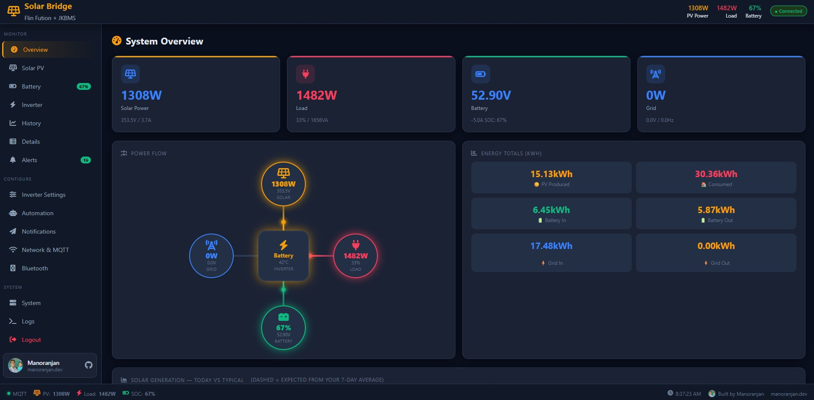
<br><sub>Live overview — animated gauges, cross power-flow, battery status & generation forecast</sub>
</div>

---

## ✨ Features

<table>
<tr>
<td width="33%" valign="top">

### 📊 Monitor
- Animated **analog gauges** (solar / load / battery / grid)
- **Cross power-flow** diagram, live
- **32 battery cells** individually
- Battery **charge / discharge** status + ETA
- History charts (6 h → 7 d)
- Today's generation **vs typical**

</td>
<td width="33%" valign="top">

### 🎛️ Control
- Output & charger **priority**
- Max charge / grid-charge **current**
- Float / bulk / shutdown **voltages**
- Applied straight to the inverter
- Every change **audited to Telegram**
- Works even if **MQTT is down**

</td>
<td width="33%" valign="top">

### 🔔 Stay informed
- Smart **alerts** (SOC, temp, fault…)
- **Telegram bot** + daily summary
- **₹ cost & savings** tracking
- CSV export
- Auto + **cloud backups**
- Hardware **watchdog**

</td>
</tr>
</table>

<div align="center">

| 🏠 **Home Assistant** | 🌍 **Remote access** | 📱 **Installable PWA** | 💿 **Flashable OS** |
|:---:|:---:|:---:|:---:|
| MQTT auto-discovery + a custom Lovelace card | Tailscale **and** Cloudflare Tunnel, with a setup guide | Add to your phone's home screen | Build your own SD-card image |

</div>

---

## 🔌 How it works

<div align="center">
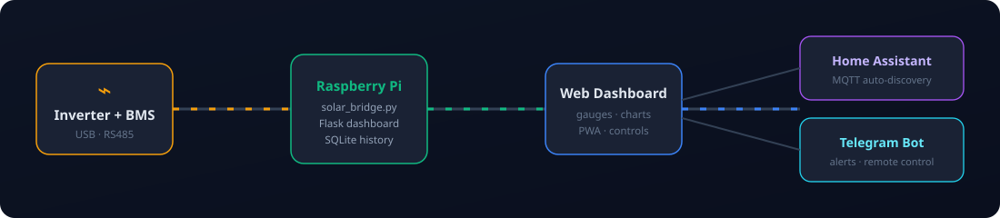
</div>

The Raspberry Pi reads the inverter over **USB-HID** (Voltronic PI30) and the dual JK BMS over **RS485**, then serves a local dashboard, publishes to **Home Assistant via MQTT**, and runs a **Telegram bot** — all offline-first. The dashboard reads a local state file and queues commands locally, so a broker outage never blanks your screen.

---

## 🚀 Quick Start

```bash
# On a fresh Raspberry Pi OS Lite (64-bit recommended):
git clone https://github.com/manoranjan2050/Solar-Bridge-Flin-Fution-JKBMS.git
cd Solar-Bridge-Flin-Fution-JKBMS
bash install_all.sh
```

That's it — a short wizard asks for your MQTT / device details, then installs everything
(Python venv, all dependencies, **systemd services**, udev rules, mDNS, nightly backups,
hardware watchdog, PWA icons) and **auto-starts on boot**.

```
📊 Dashboard ready at  http://solar.local:8080   (or http://<PI_IP>:8080)
```

> 💿 **Prefer a ready-to-flash image?** Build a "Solar Bridge OS" `.img` on any Ubuntu PC —
> see **[BUILDING_OS.md](BUILDING_OS.md)**. Flash with Raspberry Pi Imager, boot, done.

---

## 🛠️ Hardware

<table>
<tr><th>Device</th><th>Connection</th><th>Port</th><th>USB ID</th></tr>
<tr><td>Inverter — Flin Fution (Voltronic/Axpert clone, 5 kVA)</td><td>USB HID cable</td><td><code>/dev/hidraw0</code></td><td><code>0665:5161</code></td></tr>
<tr><td>Battery — 2× JK BMS (16S LiFePO₄, 100 Ah each)</td><td>CH340 USB-RS485</td><td><code>/dev/ttyUSB0</code></td><td><code>1a86:7523</code></td></tr>
<tr><td>Raspberry Pi 4 (Pi OS Lite)</td><td>LAN / WiFi</td><td>—</td><td>—</td></tr>
</table>

Works with most **Voltronic / Axpert / MPP Solar / EASUN / PowMr** clones using the PI30 protocol,
and any **JK BMS** using the `55 AA EB 90` broadcast protocol.

---

## 🖥️ The Dashboard

<table>
  <tr>
    <td width="50%" align="center">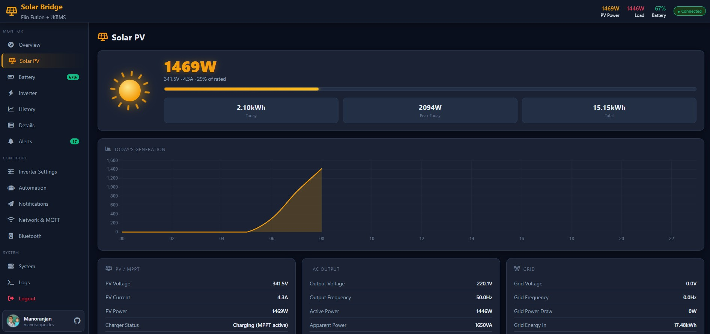<br><b>☀️ Solar PV</b><br><sub>Animated hero, today's curve, MPPT/AC/Grid detail</sub></td>
    <td width="50%" align="center">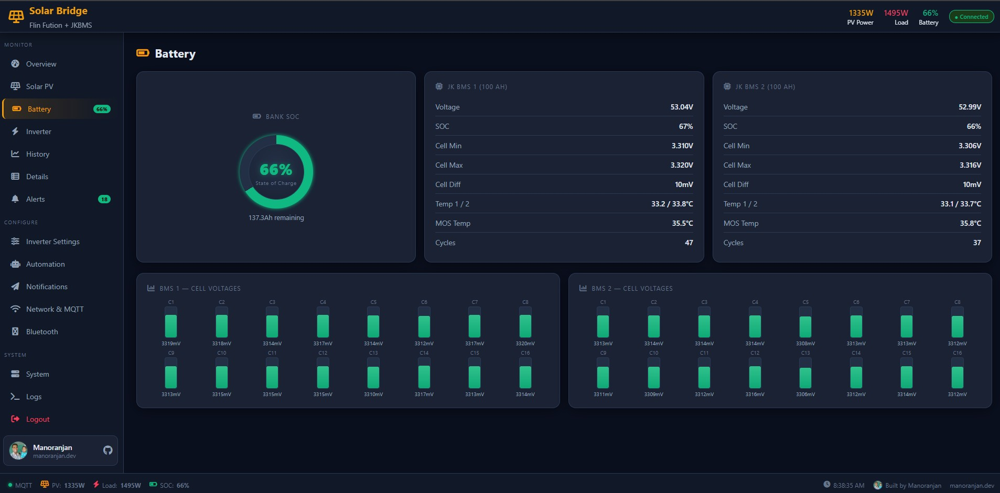<br><b>🔋 Battery</b><br><sub>SOC + amps gauges, 32 live cell bars, dual BMS</sub></td>
  </tr>
  <tr>
    <td width="50%" align="center">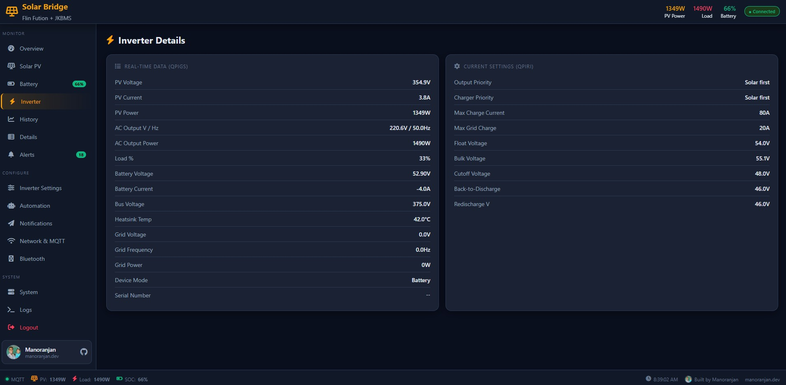<br><b>⚡ Inverter</b><br><sub>All live readings + current settings</sub></td>
    <td width="50%" align="center">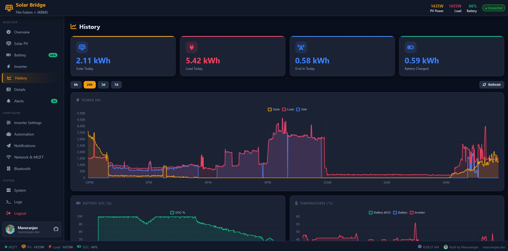<br><b>📈 History</b><br><sub>6 h – 7 d power, SOC & temperature charts</sub></td>
  </tr>
  <tr>
    <td width="50%" align="center">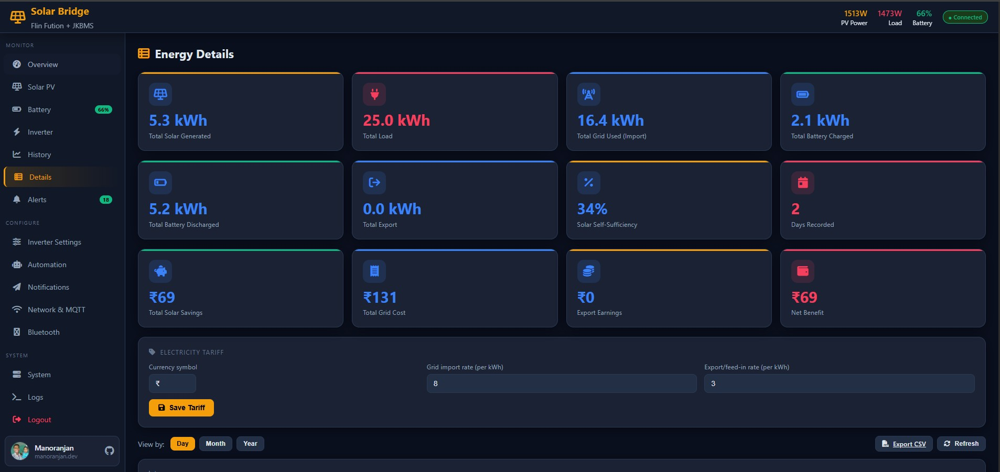<br><b>📋 Details &amp; Cost</b><br><sub>Day/month/year energy, ₹ savings, CSV export</sub></td>
    <td width="50%" align="center">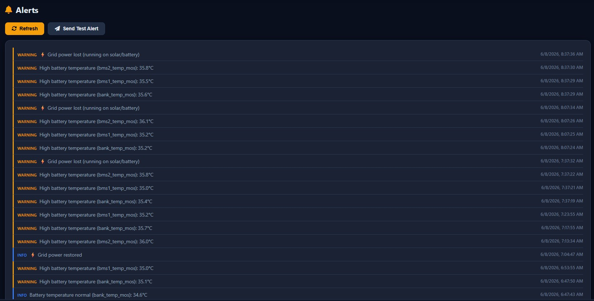<br><b>🔔 Alerts</b><br><sub>Severity-coded history + test alert</sub></td>
  </tr>
</table>

| Page | What it shows |
|---|---|
| **Overview** | Analog needle gauges, power-flow, battery status (charging/discharging + ETA), energy totals, generation forecast |
| **Solar PV** | Animated sun, production bar, today's curve, PV/MPPT + AC + Grid detail |
| **Battery** | SOC + Amps gauges, **32 animated cell bars**, per-BMS detail (V/A/temps/cycles) |
| **Inverter** | All live readings + current settings (QPIRI) |
| **History / Details** | Charts + day/month/year breakdown, self-sufficiency, savings |
| **Settings / Automation / Notifications** | Change inverter settings, build rules, configure alerts |
| **Network / Bluetooth / System / Logs** | WiFi, MQTT, **Cloudflare/Tailscale**, static IP, backups, **color-coded logs** |

---

## 🏠 Home Assistant

The bridge auto-publishes MQTT discovery — **no YAML**. In HA → **Settings → Devices & Services → MQTT** you'll find:
**Flin Fution Inverter** (sensors + control entities) and **JK BMS 1 / 2 / Battery Bank**.

There's also a **custom Lovelace card** with the whole overview (gauges, power flow, energy, battery & inverter status), installable via **HACS custom repository** — see **[ha-card/README.md](ha-card/README.md)**.

```yaml
type: custom:solar-bridge-card
title: Solar Bridge
```

---

## 💬 Telegram Bot

<table>
<tr>
<td width="33%" align="center">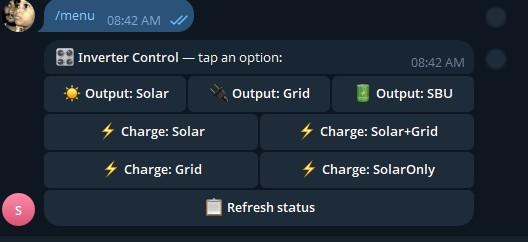<br><b>Tap-button control</b><br><sub><code>/menu</code></sub></td>
<td width="33%" align="center">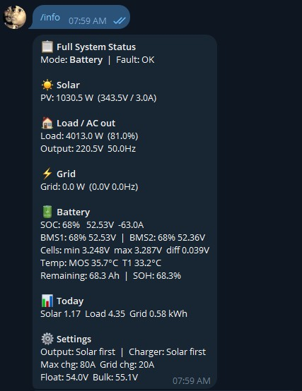<br><b>Full status</b><br><sub><code>/info</code></sub></td>
<td width="33%" align="center">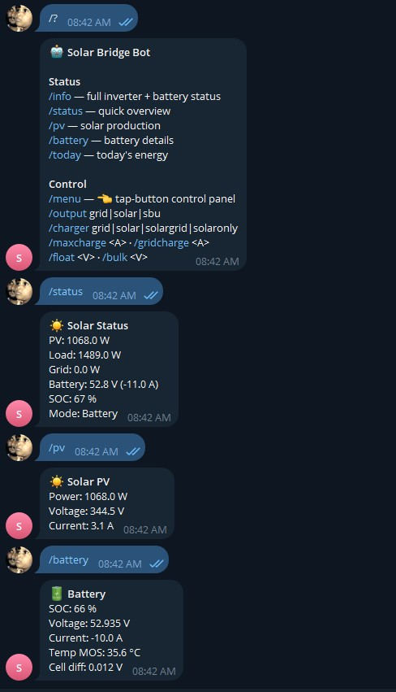<br><b>Quick queries</b><br><sub><code>/pv</code> · <code>/battery</code> · <code>/today</code></sub></td>
</tr>
</table>

Status (`/info`, `/status`, `/pv`, `/battery`, `/today`), a **tappable control panel** (`/menu`),
text control (`/output`, `/charger`, `/maxcharge`…), smart **alerts**, and an optional **daily summary** —
all from your phone, anywhere. The bot only responds to your configured chat id.

---

## 🌍 Remote Access

| Reachable at | How | Who |
|---|---|---|
| `http://<pi>.local:8080` | mDNS / LAN | Home network |
| `http://<host>.ts.net` | **Tailscale** | Your devices, private |
| `https://solar.yourdomain.com` | **Cloudflare Tunnel** | Public, gated by Access |

Set a **static IP**, manage the **Cloudflare Tunnel** (status / restart / change URL), and read a beginner
guide — all from the dashboard's Network page. Guides: **[CLOUDFLARE_TUNNEL.md](CLOUDFLARE_TUNNEL.md)**.

---

## 📖 Documentation

| Guide | What's inside |
|---|---|
| **[TROUBLESHOOTING.md](TROUBLESHOOTING.md)** | Every known issue + exact fix (MQTT, ports, BMS offsets, Tailscale, backups…) |
| **[BUILDING_OS.md](BUILDING_OS.md)** | Build a flashable Solar Bridge OS image with pi-gen |
| **[CLOUDFLARE_TUNNEL.md](CLOUDFLARE_TUNNEL.md)** | Public custom domain with HTTPS + a login gate |
| **[ha-card/README.md](ha-card/README.md)** | Install the Home Assistant custom card (HACS) |

<details>
<summary><b>⚙️ Configuration reference</b> (click to expand)</summary>

<br>

`/opt/solar-bridge/config.ini` (template: `config.ini.example`):

```ini
[mqtt]
host = 192.168.1.82
port = 1883            ; ALWAYS 1883 — never 8123
username = youruser
password = yourpass

[inverter]
port = /dev/hidraw0    ; USB HID; /dev/ttyUSB0 for serial cables
protocol = PI30

[jkbms]
port = /dev/ttyUSB0
cell_count = 16

[dashboard]
password =             ; blank = no login
hostname = solar       ; → http://solar.local:8080

[alerts]
low_soc = 20
high_battery_temp = 50
notify_on_grid_loss = true

[telegram]
enabled = false
token =
chat_id =

[cost]
currency = ₹
import_rate = 8.0
```

Most settings are editable live from the dashboard.

</details>

---

## 🔬 Protocol notes (hard-won)

<details>
<summary><b>Voltronic PI30 inverter</b> + <b>JK BMS</b> byte offsets</summary>

<br>

**Inverter** (USB-HID, 8 raw bytes/read, Voltronic table CRC) — confirmed set-commands:
`POP` output priority · `PCP` charger priority · `MUCHGC` charge current · `PBFT` float · `PCVV` bulk · `PSDV` shutdown · `PBDV` recharge.
QPIRI field `[14]`=max charge, `[16]`=output priority, `[17]`=charger priority.

**JK BMS** (new protocol `55 AA EB 90`, type-02 frame, passive broadcast):
`+6` cells (16× uint16 mV) · `+144` MOS temp · `+150` pack V (uint32 mV) · `+158` **current (int32 mA, signed)** · `+162/164` temps · `+173` SOC · `+174` remaining mAh · `+178` design mAh · `+190` SOH. Two packs distinguished by byte `+5` (`0x00`=BMS1, `0x05`=BMS2); parallel currents **add**.

</details>

---

## 🤝 Contributing & License

PRs and issues welcome — especially compatibility reports for other inverter/BMS models.
If this helped you, a ⭐ is appreciated!

Released under the **MIT License** — free to use, modify and share.

<div align="center">
<br>
<sub>☀️ Built with care by <a href="https://github.com/manoranjan2050">Manoranjan</a> — replacing paid software, one Raspberry Pi at a time.</sub>
<br><br>

[](https://github.com/manoranjan2050/Solar-Bridge-Flin-Fution-JKBMS)

</div>
