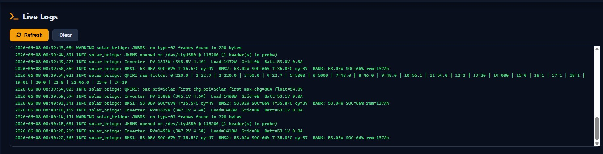

<div align="center">

# ☀️ Solar Bridge

**A self-hosted, open-source replacement for Solar Assistant.**
Monitor & control a Voltronic/Axpert-style inverter + JK BMS from a beautiful web dashboard,
Home Assistant, and Telegram — all running locally on a Raspberry Pi.

<sub>Built by <a href="https://github.com/manoranjan2050">Manoranjan</a> · <a href="https://manoranjan.dev">manoranjan.dev</a></sub>

<br>


<sub>Live overview with animated cross power-flow, energy totals & generation forecast</sub>

</div>

---

## ✨ Features

- 📊 **Web dashboard** — animated **cross power-flow** (solar/grid/inverter/load/battery), **analog needle gauges** for Solar/Load/Battery/Grid that change colour with the live value, animated battery cells & SOC gauge, battery **charging/discharging/resting** status with time-to-full / backup-time estimate
- 📱 **Installable PWA** — add to your phone's home screen, runs full-screen like a native app
- 🌍 **Remote access (Tailscale)** — see your solar **from anywhere** via a free private VPN; status, on/off switch and a beginner guide built into the Network page
- 📌 **Static IP from the dashboard** — pin the Pi's LAN address so it never changes after a router reboot
- 📈 **History & Details** — per-day/month/year energy, totals, self-sufficiency, "today vs typical" solar forecast
- 💰 **Cost & savings tracking** — set your ₹/kWh tariff → daily/monthly grid cost, solar savings, export earnings, net benefit
- 📤 **CSV export** — download day/month/year energy + cost data for spreadsheets
- 🏠 **Home Assistant** — full MQTT auto-discovery of every sensor **and** inverter controls
- 💬 **Telegram bot** — status (`/info`, `/status`, `/pv`, `/battery`, `/today`), **tappable control panel** (`/menu`) or text control (`/output`, `/charger`, `/maxcharge`, …), and an optional **daily summary**
- 🔔 **Smart alerts** — low/critical SOC, high temps, overload, over-voltage, cell imbalance, grid loss, faults, battery-full → Telegram / e-mail / Home Assistant
- 🤖 **Automation rules** — "if SOC < 30% → charge from grid", time-based schedules
- 🔐 **Optional login** — password-protect the dashboard (change credentials from the System page)
- 📲 **Settings-change audit** — every change (controls, config, WiFi, reboot, …) sends a Telegram message with the requester's IP
- 🌐 **Custom domain** — `http://solar.local` (mDNS) out of the box, or `https://solar.yourdomain.com` via the bundled nginx setup
- 💾 **Auto + cloud backups** — nightly backup at 02:30 with 14-copy rotation, **settings copy sent to your Telegram** (off-site!), manual Backup-Now buttons, full restore on a new Pi
- 🐶 **Hardware watchdog** — the Pi reboots itself automatically if it ever hard-freezes
- ⚙️ **Works even if MQTT is down** — dashboard data **and** inverter control use a local file bridge, so a broker outage never blanks your dashboard
- 🛡️ **Appliance-ready** — auto-purges old history, caps log size, auto-starts & self-restarts on boot

---

## 📸 Screenshots

<table>
  <tr>
    <td width="50%" align="center">
      <br>
      <b>☀️ Solar PV</b><br><sub>Animated sun hero, today's generation curve, MPPT/AC/Grid detail</sub>
    </td>
    <td width="50%" align="center">
      <br>
      <b>🔋 Battery</b><br><sub>Animated SOC gauge + 32 live cell bars, dual-BMS detail</sub>
    </td>
  </tr>
  <tr>
    <td width="50%" align="center">
      <br>
      <b>⚡ Inverter</b><br><sub>All live readings + current settings</sub>
    </td>
    <td width="50%" align="center">
      <br>
      <b>📈 History</b><br><sub>6h–7d charts of power, SOC & temperatures</sub>
    </td>
  </tr>
  <tr>
    <td width="50%" align="center">
      <br>
      <b>📋 Details &amp; Cost</b><br><sub>Day/month/year energy, savings (₹/kWh) & CSV export</sub>
    </td>
    <td width="50%" align="center">
      <br>
      <b>🔔 Alerts</b><br><sub>Severity-coded alert history + test alert</sub>
    </td>
  </tr>
  <tr>
    <td width="50%" align="center">
      <br>
      <b>📜 Live Logs</b><br><sub>Real-time bridge log (sensor reads, command ACKs, alerts)</sub>
    </td>
    <td width="50%" align="center">
      <br>
      <b>🎛️ Overview</b><br><sub>Animated cross power-flow + energy totals</sub>
    </td>
  </tr>
</table>

### 💬 Telegram Bot

<table>
  <tr>
    <td width="33%" align="center">
      <br>
      <b>Tap-button control</b><br><sub><code>/menu</code></sub>
    </td>
    <td width="33%" align="center">
      <br>
      <b>Full status</b><br><sub><code>/info</code></sub>
    </td>
    <td width="33%" align="center">
      <br>
      <b>Quick queries</b><br><sub><code>/status</code> · <code>/pv</code> · <code>/today</code></sub>
    </td>
  </tr>
</table>

---

## 🚀 Quick Start (fresh Raspberry Pi)

```bash
# On the Pi (Raspberry Pi OS Lite, 64-bit recommended):
git clone https://github.com/manoranjan2050/Solar-Bridge-Flin-Fution-JKBMS.git
cd Solar-Bridge-Flin-Fution-JKBMS
bash install_all.sh
```

That's it. The installer is **fully self-contained** — it will:

1. Install all system + Python dependencies (python venv, pyserial, paho-mqtt, flask, flask-socketio, eventlet, requests, avahi, network-manager)
2. Set up USB device permissions (udev) and passwordless service control (sudoers)
3. Ask you for MQTT host/credentials, device ports, dashboard port, hostname, and an optional login password (a short wizard)
4. Install both **systemd services** so everything **auto-starts on boot**
5. Enable `http://<hostname>.local:8080` via mDNS

When it finishes:

```
📊 Dashboard:  http://solar.local:8080   (or http://<PI_IP>:8080)
```

> Re-running the installer **keeps your existing `config.ini`** (won't wipe MQTT creds). Delete `/opt/solar-bridge/config.ini` first for a clean reset.

### 💿 Or build a flashable "Solar Bridge OS" image

Prefer a ready-to-flash SD-card image (like Solar Assistant OS)? Build one on any Ubuntu PC:

```bash
bash pigen/build-os.sh     # → ../pi-gen/deploy/<date>-SolarBridgeOS.img.xz
```

Flash with Raspberry Pi Imager (set WiFi in its ⚙️ settings), boot, open `http://solarbridge.local:8080` — everything pre-installed. **Full guide: [BUILDING_OS.md](BUILDING_OS.md)**

---

## 🔌 Hardware

| Device | Connection | Port | USB ID |
|---|---|---|---|
| Inverter — Flin Fution (Voltronic/Axpert clone, 5kVA hybrid) | USB HID cable | `/dev/hidraw0` | `0665:5161` |
| Battery — JK BMS (new protocol, 16S LiFePO4) ×2 parallel | CH340 USB-RS485 | `/dev/ttyUSB0` | `1a86:7523` |
| Raspberry Pi 4 (Pi OS Lite) | LAN | — | — |

Works with most Voltronic / Axpert / MPP Solar / EASUN clones (PI30) and any JK BMS using the `55 AA EB 90` broadcast protocol.

---

## 🖥️ The Dashboard

| Page | Shows |
|---|---|
| **Overview** | Animated power-flow, **analog needle gauges** (Solar/Load/Battery/Grid, colour-coded by value), **Battery Status card** (charging/discharging/resting + "time to full" / "backup left" estimate), energy totals, **solar generation forecast** (today vs typical) |
| **Solar PV** | Animated sun hero, production bar, today/peak/total, today's curve, PV/MPPT + AC + Grid detail |
| **Battery** | Animated SOC gauge + **32 animated cell bars** (charging/discharging/low, colour by cell %), per-BMS detail |
| **Inverter** | All live readings + current settings |
| **History** | 6h/24h/3d/7d charts of power, SOC, temperatures + daily energy |
| **Details** | Lifetime totals + **day/month/year** breakdown chart & table, self-sufficiency |
| **Alerts** | Alert history + Send Test Alert |
| **Inverter Settings** | Change priorities, voltages, currents (applied straight to the inverter) |
| **Automation** | Build threshold/time rules |
| **Notifications** | Telegram, e-mail & alert-threshold config |
| **Network & MQTT** | Network overview (LAN/WAN/Tailscale IPs), **Tailscale on/off + beginner guide**, WiFi scan & connect, MQTT config, device ports, **static IP setup** |
| **Bluetooth / System / Logs** | BLE scan, Pi stats, services, **backup list + Backup Now + cloud copy**, restore, change login, reboot, live logs |

### 🔐 Login
Set a password during install (or **Notifications**/`config.ini → [dashboard] password`). Blank = no login. When set, the dashboard and all control APIs require sign-in.

---

## 🌐 Custom Domain

**Local (zero config):** `http://<hostname>.local:8080` works immediately via mDNS/avahi (hostname chosen during install, e.g. `solar.local`).

**Your own domain, e.g. `https://solar.manoranjan.dev`:**

```bash
bash setup_domain.sh
```

This installs **nginx** as a reverse proxy (with WebSocket support) and optionally a **Let's Encrypt HTTPS** certificate.

**Before running it**, point the domain at your Pi:
- **LAN only** → DNS A record (or router/hosts) `solar.yourdomain.com` → Pi's LAN IP
- **Internet + HTTPS** → public DNS A record → your public IP, and forward ports **80 + 443** on your router to the Pi (required for Let's Encrypt)

**Easier public option — Cloudflare Tunnel (recommended):** get
`https://solar.yourdomain.com` with **automatic HTTPS, no port-forwarding**, and a
free **login gate** in front (essential since the dashboard controls the inverter):
```bash
bash setup_cloudflare.sh solar.yourdomain.com
```
Full walkthrough incl. the Cloudflare Access lock-down: **[CLOUDFLARE_TUNNEL.md](CLOUDFLARE_TUNNEL.md)**

---

## 🌍 Remote Access from Anywhere (Tailscale)

The safest way to reach your dashboard from outside your home — **no port forwarding, no public exposure**. Tailscale creates a free, private, encrypted network between your own devices.

**Setup (once):**
1. The installer offers to install Tailscale (or: `curl -fsSL https://tailscale.com/install.sh | sh` then `sudo tailscale up --operator=$USER`)
2. Open the login link it prints and sign in (Google / Microsoft / GitHub)
3. Install the Tailscale app on your phone/laptop and sign in with the **same account**
4. Open the **Remote URL** shown on the dashboard's **Network** page — e.g. `http://<hostname>.<tailnet>.ts.net/`

The Network page shows live Tailscale status with **Turn On / Turn Off** buttons and a built-in beginner guide. To serve the dashboard on the clean URL (no `:8080`): `sudo tailscale serve --bg --http=80 http://localhost:8080`

> Only devices signed into *your* Tailscale account can connect. Traffic is end-to-end encrypted (WireGuard). Keep the dashboard login enabled anyway.

---

## 📌 Static IP (never lose the dashboard address again)

DHCP can hand the Pi a different IP after a router reboot. Fix it from the dashboard:

**Network page → Static IP Address** → shows the current IP/gateway/DNS and mode → enter an IP **outside your router's DHCP pool** (e.g. `192.168.1.200`), gateway and DNS → **Apply Static IP**. The Pi moves to the new address within seconds (the page links you there). **Use DHCP** reverts it.

Applied via `nmcli` and persists across reboots. Needs the passwordless-sudo rule the installer sets up (`/etc/sudoers.d/solar-bridge` incl. `nmcli`).

---

## 🏠 Home Assistant

The bridge auto-publishes MQTT discovery — no YAML. In HA: **Settings → Devices & Services → MQTT** shows:
- **Flin Fution Inverter** (sensors + control entities)
- **JK BMS 1 / 2 / Battery Bank** (battery sensors)

Controls exposed: output/charger priority, max charge & grid-charge current, float/bulk/shutdown/recharge voltages. Alerts publish to `solar/alert`.

> HA depends on MQTT. If the broker login fails, the dashboard + Telegram still work (they don't need MQTT); the logs will show `MQTT CONNECTION REFUSED (rc=135, Not authorized)` so you know to fix the password.

### 🎛️ Solar Bridge Card (custom Lovelace card)

Want the **whole System Overview inside Home Assistant**? The bundled custom card gives you the
animated power flow, the 4 analog needle gauges (colour-coded), energy totals, a 24 h solar
generation chart, the battery Charging/Discharging/Resting status with time estimates, and
inverter status — in one card, theme-aware, every section toggleable:

```yaml
type: custom:solar-bridge-card
title: Solar Bridge
```

**Install via HACS:** HACS → ⋮ → Custom repositories → add this repo URL with type **Dashboard**
→ download "Solar Bridge Card". Full guide (incl. manual install + entity mapping):
**[ha-card/README.md](ha-card/README.md)**

---

## 💬 Telegram Bot

1. **@BotFather** → `/newbot` → copy the **token**
2. **@userinfobot** → copy your numeric **chat id**
3. Dashboard → **Notifications** → enable Telegram, paste both → **Save** → **Send Test Alert**

**Status commands**

| Command | Reply |
|---|---|
| `/info` | Full status: solar, load, grid, battery, per-BMS, cells, temps, today, settings |
| `/status` | Quick overview |
| `/pv` · `/battery` · `/today` | Focused views |

**Control commands** (drive the inverter; work even with MQTT down — the inverter ACKs each)

| Command | Action |
|---|---|
| **`/menu`** | **Tappable button panel** for output/charger priority (easiest) |
| `/output grid \| solar \| sbu` | Output source priority |
| `/charger grid \| solar \| solargrid \| solaronly` | Charger source priority |
| `/maxcharge 60` | Max charge current (A) |
| `/gridcharge 20` | Max grid charge current (A) |
| `/float 54.0` · `/bulk 55.1` | Battery voltages (V) |

**Daily summary:** enable it on the Notifications page to get a once-a-day digest (solar, load, grid, peak PV, lowest SOC, self-sufficiency) at a time you choose.

The bot only responds to your configured chat id.

---

## 🤖 Automation

Dashboard → **Automation** → *Add Rule*:
- **Threshold** — e.g. `Battery SOC < 30 → Charger = Solar+Grid`
- **Time** — e.g. `at 07:00 → Charger = Solar only`

Stored in `automation.json`; saving restarts the bridge.

---

## 🔔 Alerts

Edge-triggered (fire once, recover when normal, cooldown to avoid spam):
low/critical **SOC**, high **battery/inverter temperature**, **overload**, **battery over-voltage**, **cell over-voltage**, **cell imbalance**, **grid lost/restored**, **inverter fault**, **battery full**. All thresholds editable on the **Notifications** page; delivered to Telegram, e-mail, and Home Assistant.

---

## 💾 Backups (automatic, manual & cloud)

Three layers of protection, all visible on the **System** page:

| Layer | What happens |
|---|---|
| **Automatic (nightly)** | `solar-backup.timer` runs at **02:30**: full backup (settings + history DB) saved to `/opt/solar-bridge/backups/`, oldest deleted after **14** copies |
| **Cloud (Telegram)** | Each nightly run also sends a small **settings-only zip to your Telegram chat** — a free off-site copy that survives a dead SD card |
| **Manual** | **Backup Now** / **Backup + Cloud** buttons, list of all backups with download/delete, plus the classic download-to-browser buttons |

**Restore:** System page → *Restore from Backup* → pick any backup `.zip` (downloaded, from Telegram, or from the list) → bridge restarts with your settings. Great before re-flashing or moving to a new Pi.

Tune in `config.ini → [backup]`: `keep` (rotation count), `include_history`, `to_telegram`, `to_email`.

> ⚠️ Backup zips contain `config.ini` (passwords) — treat downloaded backups like a password file.

---

## 🐶 Hardware Watchdog

The installer enables the Raspberry Pi's hardware watchdog via systemd (`RuntimeWatchdogSec=15`). If the Pi ever hard-freezes, the hardware reboots it automatically — and since both services auto-start, monitoring resumes by itself. Verify with:
`journalctl -b | grep -i watchdog` → "Watchdog running with a hardware timeout…".

---

## ⚙️ Configuration Reference

`/opt/solar-bridge/config.ini` (a template is in `config.ini.example`):

```ini
[mqtt]
host = 192.168.1.82
port = 1883
username = youruser
password = yourpass

[inverter]
port = /dev/hidraw0     ; USB HID; /dev/ttyUSB0 for serial cables
protocol = PI30
poll_interval = 10

[jkbms]
port = /dev/ttyUSB0
baud = 115200
cell_count = 16

[dashboard]
username = admin
password =               ; blank = no login
hostname = solar         ; → http://solar.local:8080

[alerts]
enabled = true
low_soc = 20
critical_soc = 10
high_battery_temp = 50
high_inverter_temp = 75
high_cell_diff = 0.1
overload_pct = 90
high_battery_voltage = 57.0
cell_overvoltage = 3.65
notify_on_grid_loss = true
notify_on_fault = true
notify_on_overload = true
notify_on_full = true
cooldown = 1800

[telegram]
enabled = false
token =
chat_id =

[email]
enabled = false
smtp_host = smtp.gmail.com
smtp_port = 587
username =
password =               ; use an app password
from_addr =
to_addr =

[backup]
include_history = true   ; nightly local backup includes the history DB
keep = 14                ; rotation — how many copies to keep
to_telegram = true       ; send settings zip to Telegram every night
to_email = false         ; e-mail the backup as an attachment
```

Most settings are editable from the dashboard.

---

## 🏗️ Architecture

```
Raspberry Pi
└── /opt/solar-bridge/
    ├── solar_bridge.py     # collector: polls inverter (QPIGS/QPIRI/QMOD/QPIWS) + BMS,
    │                       #   publishes MQTT, accumulates energy, runs alerts + automation,
    │                       #   writes live_state.json, processes control_queue.json
    ├── solar_db.py         # SQLite history (readings, daily_energy, alerts)
    ├── notifier.py         # Telegram (alerts + command bot) / e-mail / HA alerts
    ├── automation.py       # threshold + time rule engine
    ├── backup_manager.py   # nightly/manual backups + rotation + Telegram/e-mail cloud copy
    ├── config.ini          # settings        live_state.json   # live data for dashboard
    ├── energy.json         # kWh totals      control_queue.json# dashboard→bridge commands
    ├── solar_bridge.db     # history         automation.json   # rules
    ├── backups/            # rotated nightly + manual backup zips
    ├── dashboard/app.py + templates/         # Flask + Socket.IO web UI
    └── venv/

systemd:  solar-bridge.service · solar-dashboard.service · solar-backup.timer (02:30 nightly)
          + hardware watchdog (RuntimeWatchdogSec=15 — auto-reboot on freeze)
optional: nginx (reverse proxy) via setup_domain.sh · Tailscale (remote access)
```

**Why it's resilient:** the dashboard reads `live_state.json` and sends control via `control_queue.json`, both written/read locally — so it keeps working even if the MQTT broker is unreachable. MQTT is only required for Home Assistant.

---

## 🔄 Deploying Code Changes (developers)

```bash
# Configure once: copy deploy_secrets.example.py → deploy_secrets.py (git-ignored) and fill in Pi creds,
# or set DEPLOY_HOST / DEPLOY_USER / DEPLOY_PASS env vars.
python deploy.py            # uploads bridge + modules, installs deps, restarts services
```
`config.ini` is never uploaded by `deploy.py`, so live credentials are safe.

---

## 🛠️ Troubleshooting

> 📖 **Full guide with every known issue & fix:** see **[TROUBLESHOOTING.md](TROUBLESHOOTING.md)**
> (MQTT/HA setup, "sensors Unknown", inverter command map, BMS offsets, port mistakes, and more).

Quick reference:

| Symptom | Cause / Fix |
|---|---|
| **HA: sensors show "Unknown"** (controls have values) | Restart bridge / reload MQTT integration — sensor values are now retained. |
| **HA gets no data** | MQTT port must be **1883** (not 8123); user `manoranjan2050`; Mosquitto add-on **and** MQTT integration both enabled. |
| **Dashboard shows blank / `--` everywhere** | Bridge not running or wrong device ports. `sudo systemctl status solar-bridge`; check Logs page. |
| **Home Assistant gets no data; Logs show `rc=135 Not authorized`** | Wrong MQTT password in `config.ini [mqtt]`. Fix it (HA Mosquitto uses HA user accounts), then `sudo systemctl restart solar-bridge`. Dashboard/Telegram work regardless. |
| **Inverter setting changes don't apply** | They go via the local command queue now — check Logs for `CMD … -> ACK`. `FAIL`/`NAK` = inverter rejected; `ACK` = applied. |
| **"Save & Restart" / Reboot button: `sudo: a password is required`** | Passwordless sudo rule missing. Re-run `bash install_all.sh` (installs `/etc/sudoers.d/solar-bridge`). |
| **No inverter data / NAK** | `ls /dev/hidraw*` exists? Unplug/replug; confirm protocol `PI30`. |
| **BMS: "no type-02 frames"** occasionally | Normal — it retries; the BMS broadcasts intermittently. |
| **Wrong battery SOC** | Fixed in this project (JK new-protocol offsets). If still off, capture a frame and check offsets in `solar_bridge.py`. |
| **`http://solar.local` not resolving** | Reboot the Pi (hostname change), ensure `avahi-daemon` running; use the IP meanwhile. |
| **Custom domain not loading** | DNS A record must point to the Pi; for HTTPS, ports 80/443 must reach it. See `setup_domain.sh` notes. |
| **Telegram silent** | Enable on Notifications, recheck token + chat id, ensure Pi has internet. |
| **USB permission errors** | `sudo usermod -aG dialout,plugdev <user>` then reboot. |
| **Pi IP changed after reboot** | Set a **static IP**: Network page → Static IP Address. |
| **Static IP "Permission denied"** | sudoers rule missing `nmcli` — re-run `bash install_all.sh`. |
| **Tailscale URL not working** | Phone must have the Tailscale app ON, signed into the *same* account. Check Network page status. |
| **No nightly backups appearing** | `systemctl status solar-backup.timer` — re-run installer if missing. |

Handy commands:

```bash
sudo systemctl restart solar-bridge solar-dashboard
sudo journalctl -u solar-bridge -f          # live bridge logs (sensor reads, CMD ACKs, alerts)
sudo journalctl -u solar-dashboard -f       # web server logs
cat /opt/solar-bridge/energy.json           # energy totals
ls -la /dev/hidraw* /dev/ttyUSB*            # devices
```

---

## 📡 Protocol Notes

**Inverter (Voltronic PI30 / USB HID):** 9-byte writes (`0x00` + 8 data), 8 raw bytes per read packet, Voltronic table CRC-16, responses start `(`, set commands reply `(ACK`/`(NAK`.

**JK BMS (`55 AA EB 90`, type `0x02`):** broadcasts ~1/s. Offsets: cells `+6` (16×u16 mV), MOS temp `+144`, pack V `+150`, temp1/2 `+162/164`, **SOC `+173` (u8)**, remaining cap `+174`, design cap `+178`, cycles `+182`, SOH `+190`. Two packs distinguished by frame byte `+5` (`0x00`=BMS1, `0x05`=BMS2).

---

## ⚠️ Known Issues

- **BMS current reads 0 A** — current-field offset not yet confirmed for this firmware; power is derived from the inverter.
- **JK BMS is read-only** (passive monitoring). Charging behaviour is controlled via the inverter, not the BMS.

---

## 🙏 Credits

Built by **[Manoranjan](https://github.com/manoranjan2050)** · [manoranjan.dev](https://manoranjan.dev)

Use at your own risk. Always verify inverter setting changes against your battery/installer specifications.
